# 🤖 medAI — Clinical Speech & Documentation Platform

[](https://github.com/AteetVatan/medai.git)
[](https://python.org)
[](https://fastapi.tiangolo.com)
[](https://docker.com)
[](LICENSE)

> **A real-time clinical intake and documentation backend** with speech-to-text, medical entity recognition, LLM-powered summarization, translation, and PDF report generation — purpose-built for physiotherapy clinics operating in German-speaking environments.

🔗 **Repository**: [https://github.com/AteetVatan/medai.git](https://github.com/AteetVatan/medai.git)

---

## 📑 Table of Contents

- [Architecture Overview](#-architecture-overview)
- [System Architecture Diagram](#-system-architecture-diagram)
- [Processing Pipeline](#-processing-pipeline)
- [Core Services](#-core-services)
- [Report Generation Subsystem](#-report-generation-subsystem)
- [API Reference](#-api-reference)
- [WebSocket Protocol](#-websocket-protocol)
- [Frontend](#-frontend)
- [Database Schema](#-database-schema)
- [Configuration](#-configuration)
- [Performance Guardrails](#-performance-guardrails)
- [Security & Compliance](#-security--compliance)
- [Project Structure](#-project-structure)
- [Quick Start](#-quick-start)
- [Docker Deployment](#-docker-deployment)
- [Testing](#-testing)
- [Development](#-development)
- [Tech Stack](#-tech-stack)
- [License & Contributing](#-license--contributing)

---

## 🏗️ Architecture Overview

medAI follows a **modular, service-oriented architecture** built on FastAPI. Each concern is isolated into its own service layer, orchestrated by an **Agno-based Clinical Intake Agent** that executes the full pipeline as a sequence of tool calls.

### Core Components

| Component | Technology | Purpose |
|---|---|---|
| **STT Service** | Faster-Whisper (local) + Together AI (cloud) | Speech-to-text with automatic fallback |
| **NER Service** | External microservice (Railway) | Medical entity recognition with ICD coding |
| **LLM Service** | Mixtral 8x7B (Mistral API) + OpenRouter/Together fallbacks | Clinical summarization & structured note generation |
| **Translation Service** | Google Translator (deep-translator) | Multi-language translation (DE/EN/FR/ES/IT) |
| **Storage Service** | Supabase Postgres + S3 | Persistent storage with signed URLs |
| **Report Service** | Jinja2 + WeasyPrint/ReportLab | PDF clinical report generation |
| **Clinical Agent** | Agno 2.1.1 framework | Pipeline orchestration |
| **Audio Processor** | FFmpeg (imageio-ffmpeg) + NumPy | Audio format conversion, normalization, chunking |
| **Cache Manager** | In-memory with TTL | Thread-safe response caching |

---

## 🔭 System Architecture Diagram

```mermaid
graph TB
    subgraph "Client Layer"
        FE["🌐 Frontend<br/>Vanilla JS + WebSocket"]
        API_CLIENT["📱 API Clients"]
    end

    subgraph "API Layer (FastAPI)"
        REST["REST Endpoints<br/>/health, /patients, /encounters,<br/>/clinical-intake, /audio"]
        WS["WebSocket Server<br/>/ws/{session_id}"]
        REPORTS_ROUTER["Reports Router<br/>/api/reports/*"]
    end

    subgraph "Orchestration Layer"
        AGENT["🤖 Clinical Intake Agent<br/>(Agno Framework)"]
        STT_TOOL["STT Tool"]
        NER_TOOL["NER Tool"]
        LLM_TOOL["LLM Tool"]
        TRANS_TOOL["Translation Tool"]
        STORE_TOOL["Storage Tool"]
    end

    subgraph "Service Layer"
        STT["STT Service<br/>Faster-Whisper + Together AI"]
        NER["NER Service<br/>External Microservice"]
        LLM["LLM Service<br/>Mixtral 8x7B + Fallbacks"]
        TRANS["Translation Service<br/>Google Translator"]
        STORAGE["Storage Service<br/>Supabase + S3"]
        AUDIO["Audio Processor<br/>FFmpeg + NumPy"]
        CACHE["Cache Manager<br/>In-Memory TTL"]
    end

    subgraph "Report Subsystem"
        EXTRACTOR["Report Extractor<br/>LLM-Powered"]
        PDF_RENDER["PDF Renderer<br/>WeasyPrint / ReportLab"]
        TEMPLATES["Jinja2 Templates<br/>report.html.j2"]
    end

    subgraph "External Services"
        MISTRAL["Mistral AI API"]
        OPENROUTER["OpenRouter API"]
        TOGETHER["Together AI API"]
        SUPABASE["Supabase<br/>Postgres + S3"]
        NER_MICRO["NER Microservice<br/>(Railway)"]
        GOOGLE_T["Google Translator"]
    end

    FE --> WS
    FE --> REST
    FE --> REPORTS_ROUTER
    API_CLIENT --> REST
    REST --> AGENT
    WS --> AGENT
    REPORTS_ROUTER --> EXTRACTOR
    REPORTS_ROUTER --> PDF_RENDER

    AGENT --> STT_TOOL --> STT
    AGENT --> NER_TOOL --> NER
    AGENT --> LLM_TOOL --> LLM
    AGENT --> TRANS_TOOL --> TRANS
    AGENT --> STORE_TOOL --> STORAGE

    STT --> AUDIO
    STT --> TOGETHER
    LLM --> MISTRAL
    LLM --> OPENROUTER
    LLM --> TOGETHER
    LLM --> CACHE
    NER --> NER_MICRO
    TRANS --> GOOGLE_T
    STORAGE --> SUPABASE

    EXTRACTOR --> LLM
    PDF_RENDER --> TEMPLATES
```



---

## 🔄 Processing Pipeline

The **Clinical Intake Agent** orchestrates the full pipeline as a sequential chain of tool calls:


### Pipeline Steps In Detail

1. **Audio Ingestion** — WebSocket receives binary audio chunks (webm/opus), buffers them, and sends partial transcription updates in real-time
2. **Audio Processing** — FFmpeg converts to WAV PCM16 (mono, 16kHz), normalizes RMS, trims silence, adds tail padding
3. **Speech-to-Text** — Faster-Whisper (local) processes the audio; Together AI Whisper serves as cloud fallback
4. **Medical NER** — External microservice extracts entities (conditions, medications, procedures) with ICD-10 codes, confidence scores, and source model attribution
5. **LLM Summarization** — Mixtral 8x7B generates structured clinical summaries with deterministic output (temperature=0.0); OpenRouter and Together AI serve as cascading fallbacks
6. **Translation** — Google Translator handles DE↔EN/FR/ES/IT translation of structured clinical notes
7. **Storage** — Supabase Postgres stores all structured data; S3 stores audio files with signed URL access
8. **Report Generation** — LLM-powered extraction of physiotherapy report fields, rendered to PDF via Jinja2 templates + WeasyPrint/ReportLab

---

## 🔧 Core Services

### 🎤 Speech-to-Text Service (`stt_service.py`)

- **Primary**: Faster-Whisper (local GPU/CPU inference)
- **Fallback**: Together AI (openai/whisper-large-v3 cloud API)
- **Features**:
  - Real-time streaming transcription with partial results
  - Chunked audio processing (configurable chunk duration)
  - Automatic format conversion via AudioProcessor
  - Model warm-up on startup for optimal latency
  - Performance statistics tracking (total/success/failure/avg latency)
  - Health check with silent WAV test

### 🏥 Medical NER Service (`ner_service.py`)

- **Architecture**: External microservice via HTTP (deployed on Railway)
- **Endpoint**: `https://medainer-production.up.railway.app/`
- **Features**:
  - Single text extraction (`/extract`)
  - Batch text extraction (`/extract_batch`)
  - ICD-10 code mapping with descriptions
  - Entity confidence scoring
  - Source model attribution
  - Entity statistics (by category, label, source model, confidence distribution)
  - German-language medical text support (e.g., LWS-Syndrom, Paracetamol)

### 🧠 LLM Service (`llm_service.py`)

- **Primary**: Mixtral 8x7B via Mistral AI API (`open-mixtral-8x7b`)
- **Fallback Chain**: OpenRouter → Together AI
- **Features**:
  - Clinical summary generation with entity context
  - Structured notes generation (JSON/XML/Markdown)
  - Transcript cleaning for physiotherapy records
  - PII stripping before LLM calls (German medical text patterns)
  - Multiple task-specific system prompts:
    - `intake_summary` — Clinical intake documentation
    - `physio_text_cleaner` — Physiotherapy transcript standardization
  - Temperature = 0.0 everywhere for deterministic output
  - Latency-based automatic fallback triggering
  - Compliance logging for all LLM interactions
  - Response caching for repeated queries

### 🌐 Translation Service (`translation_service.py`)

- **Engine**: Google Translator (via `deep-translator` library)
- **Supported Languages**: German (de), English (en), French (fr), Spanish (es), Italian (it)
- **Features**:
  - Single text translation
  - Batch text translation
  - Structured clinical notes translation (preserves JSON structure)
  - Language code mapping with fallbacks
  - Latency monitoring with `@monitor_latency` decorator
  - Performance statistics tracking

### 💾 Storage Service (`storage_service.py`)

- **Database**: Supabase Postgres with Row-Level Security (RLS)
- **File Storage**: Supabase S3 with signed URLs
- **Features**:
  - Patient CRUD with organization isolation
  - Encounter management with referral tracking
  - Audio record storage (S3 upload + DB metadata)
  - Medical entity persistence with ICD codes
  - Clinical notes storage (raw text + structured JSON)
  - Signed URL generation (configurable expiry, default 1 hour)
  - Patient search with full-text search (German language)
  - Compliance audit event logging
  - Health check with database connectivity verification

### 🔊 Audio Processor (`audio_processor.py`)

- **Engine**: FFmpeg (via `imageio-ffmpeg`) + NumPy + wave
- **Processing**: Entirely in-memory (no temp files)
- **Features**:
  - Format conversion: webm/mp3/ogg/opus → WAV PCM16 (mono, 16kHz)
  - RMS normalization (target -20 dBFS with safe gain limiting)
  - Silence detection using frame-level RMS analysis
  - Silence trimming (leading/trailing)
  - Audio chunking for streaming STT
  - Chunk concatenation (lossless)
  - Audio info extraction (duration, sample rate, channels, RMS)
  - Test audio generation (sine wave)

### ⚡ Cache Manager (`cache.py`)

- **Type**: Thread-safe in-memory cache (no external dependencies)
- **Features**:
  - TTL-based expiration (configurable, default 3600s)
  - Cache key generation from function arguments (handles bytes, dicts, complex types)
  - `@cached` decorator for both sync and async functions
  - Manual cache key generation
  - Expired entry cleanup
  - Cache statistics (total/active/expired entries)
  - Enable/disable via environment variable

---

## 📄 Report Generation Subsystem

The report subsystem provides end-to-end clinical report generation for physiotherapy treatment documentation.

### Report Extractor (`report_extractor.py`)

- LLM-powered extraction of clinical fields from transcripts
- Deterministic prompt engineering for Mistral model
- Post-processing with:
  - Insurance type normalization (PRIVAT/GESETZLICH/UNKLAR)
  - Treatment outcome mapping (BESCHWERDEFREI/LINDERUNG/KEINE_BESSERUNG/UNKLAR)
  - Date parsing with multiple format support
  - City name cleaning with default fallback
- Default header values from configuration

### PDF Renderer (`pdf_renderer.py`)

- **Primary**: WeasyPrint (full CSS support)
- **Fallback 1**: ReportLab (parsed HTML formatting)
- **Fallback 2**: Built-in PDF generator (no dependencies)
- Jinja2 HTML template (`report.html.j2`)
- Deterministic filename generation

### Report Models (`report.py`)

- `ClinicalReport` — Complete report for PDF generation
- `ClinicalReportDraft` — AI-suggested report fields
- `ReportSuggestionRequest` — Multi-source transcript input
- `InsuranceType` — German insurance categories enum
- `TreatmentOutcome` — Therapy outcome categories with synonym mapping

---

## 🔧 API Reference

### REST Endpoints

| Method | Endpoint | Description |
|--------|----------|-------------|
| `GET` | `/health` | System health check (all services + cache stats) |
| `GET` | `/` | Serve frontend HTML page |
| `POST` | `/patients` | Create new patient record |
| `GET` | `/patients?q=search` | Search patients by name or patient number |
| `POST` | `/encounters` | Create new clinical encounter |
| `GET` | `/encounters/{id}` | Get encounter with related data |
| `POST` | `/clinical-intake` | Process clinical audio intake (full pipeline) |
| `GET` | `/audio/{id}/download` | Get signed URL for audio download |

### Report Endpoints

| Method | Endpoint | Description |
|--------|----------|-------------|
| `GET` | `/api/reports/defaults` | Get default report header fields |
| `POST` | `/api/reports/suggest` | Generate AI-powered report draft from transcript |
| `POST` | `/api/reports/pdf` | Render clinical report as downloadable PDF |
| `POST` | `/api/reports/save` | Persist report as JSON to disk |

### Interactive Documentation

- **Swagger UI**: `http://localhost:8000/docs`
- **ReDoc**: `http://localhost:8000/redoc`

---

## 🔌 WebSocket Protocol

### Connection

```
WS /ws/{session_id}?user_id=demo_user&organization_id=demo_org
```

### Message Types (Client → Server)

| Type | Description | Payload |
|------|-------------|---------|
| `start_session` | Initialize recording session | `{ encounter_id, task_type, language }` |
| `start_recording` | Begin new recording within session | `{ audio_format }` |
| `audio_chunk` | Binary audio data chunk | `{ audio_data (base64), chunk_index }` |
| `end_recording` | Finalize recording, trigger processing | `{}` |
| `end_session` | Close session and cleanup | `{}` |
| `ping` | Keep-alive heartbeat | `{}` |

### Message Types (Server → Client)

| Type | Description |
|------|-------------|
| `session_started` | Session initialization confirmed |
| `recording_started` | Recording active |
| `partial_transcription` | Real-time transcription update |
| `processing_started` | Full pipeline processing begun |
| `processing_complete` | Final results (transcript, entities, summary, notes) |
| `error` | Error with descriptive message |
| `pong` | Heartbeat response |

### Connection Management

- `WebSocketManager` — Manages active connections, audio buffers, session data, and partial transcriptions
- `ConnectionManager` — FastAPI-native connection lifecycle management
- Automatic cleanup on disconnect

---

## 🖥️ Frontend

The frontend is built with **vanilla JavaScript** — no build process, no npm, no React.

### Files

| File | Size | Purpose |
|------|------|---------|
| `index.html` | 12.4 KB | Application shell with responsive layout |
| `script.js` | 55.7 KB | Full application logic, WebSocket client, report form |
| `styles.css` | 16.8 KB | Complete styling |

### Features

1. **Session Management** — Enter encounter ID, select task type (intake summary, physiotherapy text cleaning)
2. **Real-Time Audio Recording** — Browser MediaRecorder API with WebSocket streaming
3. **Live Transcription** — Partial transcription updates displayed in real-time
4. **Clinical Results Display** — Structured clinical notes with extracted entities and summaries
5. **Report Form** — Dynamic form pre-filled with AI-suggested report fields
6. **PDF Generation** — Fill, review, and download physiotherapy treatment reports as PDF
7. **Data Export** — Export results as JSON or PDF

---

## 🗄️ Database Schema

Supabase Postgres with Row-Level Security (RLS) and UUID primary keys.


### Key Database Features

- **Multi-tenant isolation** via `organization_id` on all tables
- **Row-Level Security (RLS)** policies for data access control
- **Full-text search** indexes (German) on patients, entities, and notes
- **JSONB fields** for flexible metadata storage
- **Automatic `updated_at` triggers** on all mutable tables
- **UUID primary keys** with `uuid-ossp` extension

---

## ⚙️ Configuration

### Environment Variables

Copy `env.example` → `.env` and configure:

```bash
# NER Microservice
NER_MICROSERVICE_BASE_URL=https://medainer-production.up.railway.app/

# API Keys
TOGETHER_API_KEY=your_together_api_key
MISTRAL_API_KEY=your_mistral_api_key
OPENROUTER_API_KEY=your_openrouter_api_key

# Supabase
SUPABASE_URL=https://your-project.supabase.co
SUPABASE_KEY=your_supabase_anon_key
SUPABASE_PASSWORD=your_supabase_password

# Latency Thresholds (ms)
STT_PARTIAL_THRESHOLD=300
STT_FINAL_THRESHOLD=2000
LLM_SUMMARY_THRESHOLD=1800
TRANSLATION_THRESHOLD=1000

# Security & Compliance
ENABLE_PII_STRIPPING=true
AUDIT_LOG_RETENTION_DAYS=90

# Performance
MAX_CONCURRENT_REQUESTS=10
REQUEST_TIMEOUT=30
ENABLE_CACHING=true
CACHE_TTL=3600

# Logging
LOG_LEVEL=INFO
ENABLE_STRUCTURED_LOGGING=true
```

### Model Configuration Constants

| Constant | Value | Description |
|----------|-------|-------------|
| `TEMPERATURE` | 0.0 | Deterministic LLM output |
| `TOP_P` | 1.0 | Full nucleus sampling |
| `MAX_TOKENS_LLM` | 2048 | LLM response limit |
| `MAX_TOKENS_TRANSLATION` | 1024 | Translation response limit |
| `MISTRAL_MODEL` | `open-mixtral-8x7b` | Primary LLM model |
| `TOGETHER_WHISPER_MODEL` | `openai/whisper-large-v3` | Cloud STT model |
| `FALLBACK_LLM_MODEL` | `microsoft/Phi-3-mini-4k-instruct` | Fallback LLM |

---

## ⚡ Performance Guardrails

### Latency Thresholds

| Operation | Warning | Critical | Fallback Trigger |
|-----------|---------|----------|------------------|
| STT Partial | — | — | ≤ 300ms target |
| STT Final | 1000ms | 2000ms | 2500ms |
| LLM Summary | 1500ms | 3000ms | 2500ms |
| Translation | 800ms | 1500ms | 1200ms |

### Optimization Strategies

1. **Chunked Audio Streaming** — 1–2s chunks for real-time partial transcription
2. **Async/Await Throughout** — Non-blocking I/O on all service calls
3. **Model Warm-Up** — STT model initialization on startup
4. **In-Memory Caching** — TTL-based caching for repeated LLM and translation requests
5. **Parallel Processing** — Concurrent service calls where dependencies allow
6. **Automatic Fallback** — Cascading provider switching on latency threshold breach
7. **RMS Normalization** — Consistent audio levels for reliable STT performance

---

## 🔒 Security & Compliance

### Data Protection

- **PII Stripping** — Automatic removal of personally identifiable information before LLM calls (phone numbers, addresses, dates, German medical text patterns)
- **Signed URLs** — Time-limited S3 access for audio files (default 1-hour expiry)
- **Row-Level Security** — Supabase RLS policies enforce organization-based data isolation
- **Compliance Audit Logging** — Every data access and modification is logged with user/action/resource/timestamp

### Access Control

- Organization-based multi-tenant data isolation
- User role-based permissions
- Session-based WebSocket connections
- API key rotation support for external services

### Logging

- **Structured JSON logging** — Machine-parseable log output
- **Request ID tracking** — Correlation across service calls
- **Latency logging** — Dedicated latency logger with threshold alerting
- **Compliance logger** — Separate audit trail for regulatory compliance

---

## 📁 Project Structure

```
server/
├── src/
│   ├── __init__.py
│   ├── agents/
│   │   └── clinical_intake_agent.py    # Agno agent orchestration (STT→NER→LLM→Translation→Storage)
│   ├── api/
│   │   ├── main.py                     # FastAPI app, REST endpoints, middleware, static files
│   │   └── ws.py                       # WebSocket handlers, connection/session management
│   ├── app/
│   │   ├── config/
│   │   │   └── report_defaults.py      # Default report header values
│   │   ├── models/
│   │   │   └── report.py              # Pydantic models for clinical reports
│   │   ├── routers/
│   │   │   └── reports.py             # REST router for report operations
│   │   ├── services/
│   │   │   ├── pdf_renderer.py        # HTML→PDF rendering (WeasyPrint/ReportLab/builtin)
│   │   │   └── report_extractor.py    # LLM-powered report field extraction
│   │   └── templates/
│   │       └── report.html.j2         # Jinja2 template for PDF reports
│   ├── db/
│   │   ├── schema.sql                 # Supabase Postgres schema (9 tables)
│   │   └── rls.sql                    # Row-Level Security policies
│   ├── models/
│   │   └── entity_model.py            # Medical entity dataclass (ICD codes, confidence)
│   ├── services/
│   │   ├── stt_service.py             # Speech-to-text (Faster-Whisper + Together AI)
│   │   ├── ner_service.py             # Medical NER via external microservice
│   │   ├── llm_service.py             # LLM summarization (Mixtral 8x7B + fallbacks)
│   │   ├── translation_service.py     # Translation (Google Translator)
│   │   └── storage_service.py         # Supabase Postgres + S3 storage
│   └── utils/
│       ├── config.py                  # Pydantic settings, model & latency config
│       ├── logging.py                 # Structured JSON logging, latency & compliance loggers
│       ├── cache.py                   # In-memory TTL cache with decorator support
│       └── audio/
│           └── audio_processor.py     # FFmpeg+NumPy audio processing (in-memory)
│
├── frontend/
│   ├── index.html                     # Application shell
│   ├── script.js                      # WebSocket client, recording, report form
│   └── styles.css                     # Complete application styling
│
├── tests/
│   ├── test_stt.py                    # STT service tests
│   ├── test_ner.py                    # NER service tests
│   ├── test_llm.py                    # LLM service tests
│   ├── test_translation.py            # Translation service tests
│   ├── test_clinical_agent.py         # Agent orchestration tests
│   ├── test_caching.py               # Cache manager tests
│   ├── test_pdf_renderer.py          # PDF rendering tests
│   └── test_report_extractor.py      # Report extractor tests
│
├── Dockerfile                         # Production Docker image (Python 3.12-slim)
├── Dockerfile.minimal                 # Minimal dependencies build
├── Dockerfile.alternative             # Alternative package management
├── docker-build.bat                   # Windows Docker build script
├── docker-build.sh                    # Linux/Mac Docker build script
├── DOCKER.md                          # Docker deployment documentation
├── requirements.txt                   # Python dependencies
├── env.example                        # Environment variable template
├── start_dev.py                       # Development/production server startup
├── run_tests.py                       # Test runner
├── LICENSE                            # Project license
└── README.md                          # This file
```

---

## 🚀 Quick Start

### Prerequisites

- **Python 3.12+**
- **Docker** (optional, for containerized deployment)
- API keys for: Mistral AI, Together AI, OpenRouter, Supabase

### Local Development

1. **Clone the repository**:
   ```bash
   git clone https://github.com/AteetVatan/medai.git
   cd medai/project/server
   ```

2. **Create virtual environment**:
   ```bash
   python -m venv .venv
   # Windows
   .venv\Scripts\activate
   # Linux/Mac
   source .venv/bin/activate
   ```

3. **Install dependencies**:
   ```bash
   pip install -r requirements.txt
   ```

4. **Configure environment**:
   ```bash
   cp env.example .env
   # Edit .env with your API keys
   ```

5. **Start the development server**:
   ```bash
   python start_dev.py
   # Or directly with uvicorn:
   uvicorn src.api.main:app --reload
   ```

6. **Access the application**:
   - **Frontend**: http://localhost:8000
   - **Swagger UI**: http://localhost:8000/docs
   - **ReDoc**: http://localhost:8000/redoc

---

## 🐳 Docker Deployment

### Quick Start (Recommended)

**Windows:**
```bash
docker-build.bat
```

**Linux/Mac:**
```bash
./docker-build.sh
```

### Manual Docker Commands

```bash
# Build
docker build -t medai-mvp -f Dockerfile .

# Run
docker run -d \
    --name medai-mvp-container \
    -p 8000:8000 \
    --env-file .env \
    --restart unless-stopped \
    medai-mvp
```

### Production Configuration

- **Host**: 0.0.0.0 (all interfaces)
- **Port**: 8000
- **Workers**: 4 (Gunicorn via `start_dev.py --production`)
- **Health Check**: Every 30s on `/health`
- **Non-root user**: Runs as `app` user for security

### Alternative Dockerfiles

| File | Use Case |
|------|----------|
| `Dockerfile` | Full production (WeasyPrint + all dependencies) |
| `Dockerfile.minimal` | Faster builds, fewer system dependencies |
| `Dockerfile.alternative` | Alternative package management approach |

See [DOCKER.md](DOCKER.md) for detailed deployment instructions and troubleshooting.

---

## 🧪 Testing

### Run All Tests

```bash
pytest
```

### Run Specific Test Suites

```bash
pytest tests/test_stt.py               # Speech-to-Text
pytest tests/test_ner.py               # Medical NER
pytest tests/test_llm.py               # LLM Summarization
pytest tests/test_translation.py       # Translation
pytest tests/test_clinical_agent.py    # Agent Pipeline
pytest tests/test_caching.py           # Cache Manager
pytest tests/test_pdf_renderer.py      # PDF Rendering
pytest tests/test_report_extractor.py  # Report Extraction
```

### With Coverage

```bash
pytest --cov=src tests/
```

### Additional Test Scripts

```bash
python run_tests.py                    # Comprehensive test runner
python test_startup.py                 # Startup validation
python test_agno_imports.py            # Agno framework verification
python test_ner_microservice.py        # NER microservice connectivity
python test_thresholds.py              # Latency threshold validation
```

---

## 🛠️ Development

### Code Quality

```bash
# Format
black src/ tests/

# Lint
flake8 src/ tests/

# Type Check
mypy src/
```

### Adding a New Service

1. Create service class in `src/services/` with health check and performance stats
2. Add corresponding Tool class in `src/agents/clinical_intake_agent.py`
3. Register the tool with the Clinical Intake Agent
4. Add tests in `tests/`
5. Update health check aggregation in `main.py`

### Database Migrations

1. Update `src/db/schema.sql`
2. Update `src/db/rls.sql` for new RLS policies
3. Test with local Supabase instance
4. Deploy migration to production Supabase

---

## 🧰 Tech Stack

| Layer | Technology |
|-------|------------|
| **Runtime** | Python 3.12+ |
| **Web Framework** | FastAPI 0.115 + Uvicorn 0.32 |
| **WebSocket** | websockets 14.0 |
| **Validation** | Pydantic 2.10 + pydantic-settings 2.7 |
| **Agent Framework** | Agno 2.1.1 |
| **STT (Local)** | faster-whisper 1.0.3 |
| **STT (Cloud)** | Together AI (openai/whisper-large-v3) |
| **LLM** | Mixtral 8x7B (Mistral API) |
| **LLM Fallbacks** | OpenRouter, Together AI |
| **NER** | External microservice (Railway) |
| **Translation** | deep-translator 1.11.4 (Google) |
| **Audio Processing** | imageio-ffmpeg 0.5.1, soundfile 0.12.1, pydub 0.25.1 |
| **ML Runtime** | PyTorch ≥ 2.0.0 |
| **Database** | Supabase (Postgres + S3) |
| **HTTP Client** | httpx 0.27.2, aiohttp 3.11.0 |
| **PDF Generation** | WeasyPrint 62.3, ReportLab 4.0.7 |
| **Templates** | Jinja2 3.1.4 |
| **WSGI Server** | Gunicorn 23.0.0 |
| **Testing** | pytest 8.3.4, pytest-asyncio, pytest-mock |
| **Code Quality** | black, flake8, mypy |
| **Frontend** | Vanilla HTML/CSS/JS (no build) |

---

## 📝 License & Contributing

### License

See [LICENSE](LICENSE) file for details.

### Contributing

1. Fork the repository
2. Create a feature branch (`git checkout -b feature/your-feature`)
3. Add tests for new functionality
4. Ensure all tests pass (`pytest`)
5. Format code (`black src/ tests/`)
6. Submit a pull request

### Support

- 📖 API Documentation: `http://localhost:8000/docs`
- 🧪 Test cases for usage examples
- ❤️ Health endpoint for service status: `GET /health`

---

<p align="center">
  Built with ❤️ for clinical excellence
</p>
